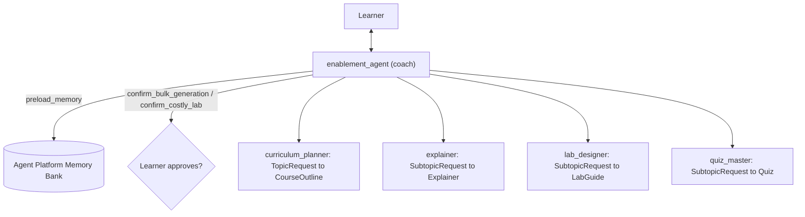

# enablement-agent

A multi-agent **enablement coach** for Google Cloud and Google AI topics, built
with [ADK](https://adk.dev/). Give it a topic (for example "Cloud Run basics")
and it:

1. breaks the topic into an ordered outline of 3-7 subtopics, then
2. for each subtopic you pick (a number, `next`, or `all`), writes an
   **explainer**, a hands-on **lab** for your own GCP project (with validation
   and cleanup steps), and a short **quiz** with answers.

Agent generated with `agents-cli` version `1.8.0`.

## Architecture



- **Coordinator + specialists.** `enablement_agent` is the only agent the
  learner talks to. The four specialists are `single_turn` sub-agents that ADK
  exposes to the coach as tools. For a subtopic the coach calls explainer, lab
  designer and quiz master one at a time; each specialist's output is shown to
  the learner once, and the coach adds only a one-line wrap-up.
- **Typed tool contracts** (`app/schemas.py`). Every specialist has an
  `input_schema` (field descriptions become tool parameter docs) and an
  `output_schema`. The learner sees deterministic markdown (`app/render.py`);
  the coach gets `{"status": "ok" | "needs_approval" | "error", ...}` with a
  `next_step` or `recovery_hint`.
- **Guided errors.** Failures become `{error_type, attempt, recovery_hint}` with
  a retry budget of one per specialist and subtopic; the retry runs on a
  stronger model.
- **Model routing** (`app/routing.py`). Base tier per role (planner =
  `gemini-3.1-pro-preview`, coach / explainer / lab = `gemini-3.8-flash`,
  quiz and compaction = `gemini-3.5-flash`), escalated one tier for retries,
  hard subtopics (complexity >= 4) or advanced learners. Override with
  `MODEL_FAST` / `MODEL_FLASH` / `MODEL_PRO`.
- **Guardrails** (`app/guardrails.py`). PII and secrets are redacted from
  learner messages before any model or log sees them; prompt-injection
  attempts are flagged; labs are linted (no broad roles, public principals,
  project deletion, recursive force deletes, piping downloads into a shell,
  inline keys, open SSH/RDP or literal project IDs; clean-up required).
  Unsafe labs are withheld and regenerated.
- **Human in the loop.** The learner must approve (1) generating several
  subtopics at once and (2) any lab estimated above \$2
  (`LAB_COST_APPROVAL_USD`). The costly lab is held back, cached in session
  state and shown after approval without a second model call; on rejection a
  cheaper variant (max \$2) is requested.
- **Memory and context.** Agent Platform Sessions keep history; Memory Bank
  keeps the learner's level, goals and completed subtopics (written in the
  background after each turn: learner messages go to topic extraction, and
  completed subtopics are written as consolidated direct memories; lesson
  content is never sent). Older turns are compacted every 4 turns.
- **Observability.** JSON logs (PII-redacted) with one intent + outcome record
  per turn (specialist statuses, retries, violations, HITL, model tier per
  call, tokens, latency), mirrored as `enablement.*` OpenTelemetry span
  attributes alongside ADK's Cloud Trace spans.

## Project Structure

```
enablement-agent/
├── app/
│   ├── agent.py               # Coach (root agent) + App (plugins, compaction)
│   ├── agents.py              # Specialist sub-agents
│   ├── prompts.py             # Instructions for every agent
│   ├── schemas.py             # Typed input/output contracts
│   ├── render.py              # JSON -> markdown for the learner
│   ├── guardrails.py          # PII redaction, injection signals, lab linter
│   ├── routing.py             # Model tier policy
│   ├── tools.py               # HITL confirmation tools
│   ├── memory.py              # Background Memory Bank writes
│   ├── observability.py       # JSON log formatter
│   ├── plugins/               # Observability, guardrail, routing plugins
│   ├── fast_api_app.py        # FastAPI Backend server
│   └── app_utils/             # Session / artifact / memory services
├── scripts/create_memory_bank.py  # Create / delete the Agent Platform instance
├── tests/                     # Unit, integration, and eval
└── pyproject.toml
```

## Memory Bank setup

Sessions and Memory Bank live on one Agent Platform instance (no agent code is
deployed to it):

```bash
uv run python scripts/create_memory_bank.py           # writes GOOGLE_CLOUD_AGENT_ENGINE_ID to .env
uv run python scripts/create_memory_bank.py --delete  # removes it (and its sessions and memories)
```

Without `GOOGLE_CLOUD_AGENT_ENGINE_ID`, sessions and memory are in-memory.

## Try it

```bash
agents-cli install
agents-cli playground                         # web UI (supports the approval prompts)
# or from the terminal:
agents-cli run --start-server "Cloud Run basics"
agents-cli run "2" --session-id <session id printed above>
```

> 💡 **Tip:** Use [Antigravity CLI](https://antigravity.google/) for AI-assisted development - project context is pre-configured in `GEMINI.md`.

## Requirements

Before you begin, ensure you have:
- **uv**: Python package manager (used for all dependency management in this project) - [Install](https://docs.astral.sh/uv/getting-started/installation/) ([add packages](https://docs.astral.sh/uv/concepts/dependencies/) with `uv add <package>`)
- **agents-cli**: Agents CLI - Install with `uv tool install google-agents-cli`
- **Google Cloud SDK**: For GCP services - [Install](https://cloud.google.com/sdk/docs/install)


## Quick Start

Install `agents-cli` and its skills if not already installed:

```bash
uvx google-agents-cli setup
```

Install required packages:

```bash
agents-cli install
```

Test the agent with a local web server:

```bash
agents-cli playground
```

You can also use features from the [ADK](https://adk.dev/) CLI with `uv run adk`.

## Commands

| Command              | Description                                                                                 |
| -------------------- | ------------------------------------------------------------------------------------------- |
| `agents-cli install` | Install dependencies using uv                                                         |
| `agents-cli playground` | Launch local development environment                                                  |
| `agents-cli lint`    | Run code quality checks                                                               |
| `agents-cli eval`    | Evaluate agent behavior (generate, grade, analyze, and more — see `agents-cli eval --help`). Prefix with `SESSION_SERVICE_URI=memory://` so seeded multi-turn cases don't use Agent Platform Sessions |
| `uv run pytest tests/unit tests/integration` | Run unit and integration tests                                                        || [A2A Inspector](https://github.com/a2aproject/a2a-inspector) | Launch A2A Protocol Inspector                                                        |

## 🛠️ Project Management

| Command | What It Does |
|---------|--------------|
| `agents-cli scaffold enhance` | Add CI/CD pipelines and Terraform infrastructure |
| `agents-cli infra cicd` | One-command setup of entire CI/CD pipeline + infrastructure |
| `agents-cli scaffold upgrade` | Auto-upgrade to latest version while preserving customizations |

---

## Development

Edit your agent logic in `app/agent.py` and test with `agents-cli playground` - it auto-reloads on save.

## Deployment

```bash
gcloud config set project <your-project-id>
agents-cli deploy
```

To add CI/CD and Terraform, run `agents-cli scaffold enhance`.
To set up your production infrastructure, run `agents-cli infra cicd`.

## Observability

Built-in telemetry exports to Cloud Trace, BigQuery, and Cloud Logging.

## A2A Inspector

This agent supports the [A2A Protocol](https://a2a-protocol.org/). Use the [A2A Inspector](https://github.com/a2aproject/a2a-inspector) to test interoperability.
See the [A2A Inspector docs](https://github.com/a2aproject/a2a-inspector) for details.
