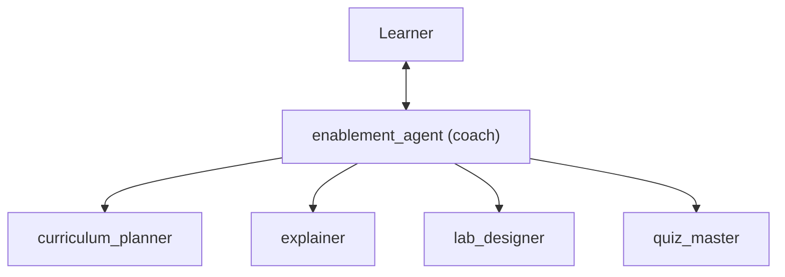

# enablement-agent

A multi-agent **enablement coach** for Google Cloud and Google AI topics, built
with [ADK](https://adk.dev/). Give it a topic (for example "Cloud Run basics")
and it:

1. breaks the topic into an ordered outline of 3-7 subtopics, then
2. for each subtopic you pick (a number, `next`, or `all`), writes an
   **explainer**, a hands-on **lab** for your own GCP project (with validation
   and cleanup steps), and a short **quiz** with answers.

Agent generated with `agents-cli` version `1.8.0`.

## Architecture



- `enablement_agent` is the only agent the learner talks to. It decides which
  specialist to call and presents the results.
- The four specialists are ADK sub-agents in `single_turn` mode: ADK exposes
  each one to the coach as a tool, so control always returns to the coach.
  For a subtopic, the coach calls the explainer, lab designer and quiz master
  in parallel.
- All agents use `gemini-3.8-flash` on Vertex AI (`GOOGLE_CLOUD_LOCATION=global`).

## Project Structure

```
enablement-agent/
├── app/         # Core agent code
│   ├── agent.py               # Coach (root agent) + App
│   ├── agents.py              # Specialist sub-agents
│   ├── prompts.py             # Instructions for every agent
│   ├── fast_api_app.py        # FastAPI Backend server
│   └── app_utils/             # App utilities and helpers
├── tests/                     # Unit, integration, and eval
├── GEMINI.md                  # AI-assisted development guide
└── pyproject.toml             # Project dependencies
```

## Try it

```bash
agents-cli install
agents-cli playground                         # web UI
# or from the terminal:
agents-cli run --start-server "Cloud Run basics"
agents-cli run "2" --session-id <session id printed above>
```

> 💡 **Tip:** Use [Antigravity CLI](https://antigravity.google/) for AI-assisted development - project context is pre-configured in `GEMINI.md`.

## Requirements

Before you begin, ensure you have:
- **uv**: Python package manager (used for all dependency management in this project) - [Install](https://docs.astral.sh/uv/getting-started/installation/) ([add packages](https://docs.astral.sh/uv/concepts/dependencies/) with `uv add <package>`)
- **agents-cli**: Agents CLI - Install with `uv tool install google-agents-cli`
- **Google Cloud SDK**: For GCP services - [Install](https://cloud.google.com/sdk/docs/install)


## Quick Start

Install `agents-cli` and its skills if not already installed:

```bash
uvx google-agents-cli setup
```

Install required packages:

```bash
agents-cli install
```

Test the agent with a local web server:

```bash
agents-cli playground
```

You can also use features from the [ADK](https://adk.dev/) CLI with `uv run adk`.

## Commands

| Command              | Description                                                                                 |
| -------------------- | ------------------------------------------------------------------------------------------- |
| `agents-cli install` | Install dependencies using uv                                                         |
| `agents-cli playground` | Launch local development environment                                                  |
| `agents-cli lint`    | Run code quality checks                                                               |
| `agents-cli eval`    | Evaluate agent behavior (generate, grade, analyze, and more — see `agents-cli eval --help`) |
| `uv run pytest tests/unit tests/integration` | Run unit and integration tests                                                        || [A2A Inspector](https://github.com/a2aproject/a2a-inspector) | Launch A2A Protocol Inspector                                                        |

## 🛠️ Project Management

| Command | What It Does |
|---------|--------------|
| `agents-cli scaffold enhance` | Add CI/CD pipelines and Terraform infrastructure |
| `agents-cli infra cicd` | One-command setup of entire CI/CD pipeline + infrastructure |
| `agents-cli scaffold upgrade` | Auto-upgrade to latest version while preserving customizations |

---

## Development

Edit your agent logic in `app/agent.py` and test with `agents-cli playground` - it auto-reloads on save.

## Deployment

```bash
gcloud config set project <your-project-id>
agents-cli deploy
```

To add CI/CD and Terraform, run `agents-cli scaffold enhance`.
To set up your production infrastructure, run `agents-cli infra cicd`.

## Observability

Built-in telemetry exports to Cloud Trace, BigQuery, and Cloud Logging.

## A2A Inspector

This agent supports the [A2A Protocol](https://a2a-protocol.org/). Use the [A2A Inspector](https://github.com/a2aproject/a2a-inspector) to test interoperability.
See the [A2A Inspector docs](https://github.com/a2aproject/a2a-inspector) for details.
